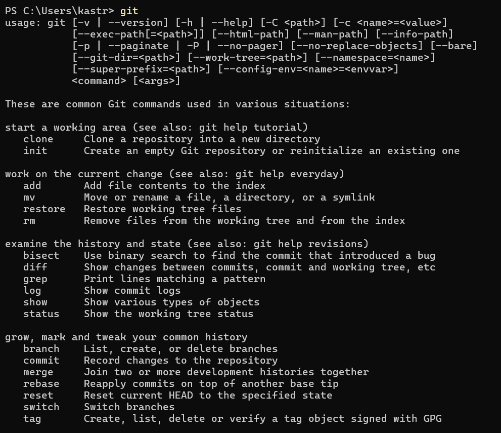
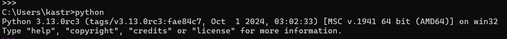
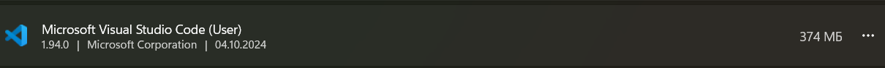
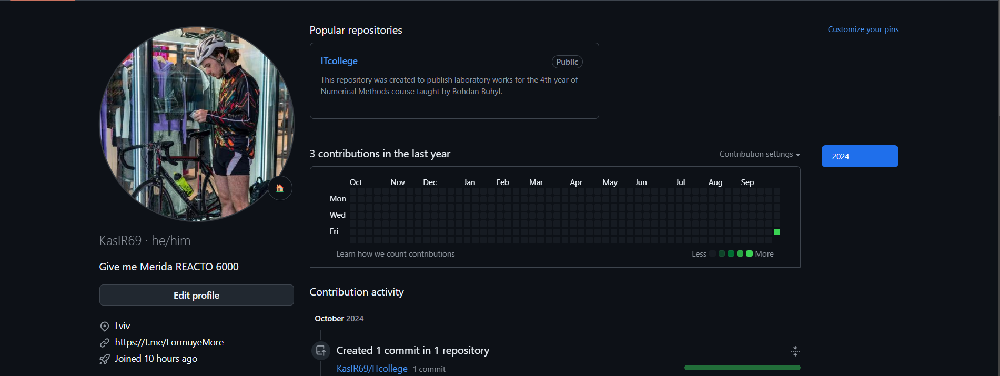

In this task, the following objectives were successfully completed:

- Git was installed on the system.

- Python 3.13 was installed.

- Visual Studio Code (Community edition) was set up.

- A new [account](https://github.com/KasIR69) was registered on GitHub.

The development environment is now fully configured for future work.