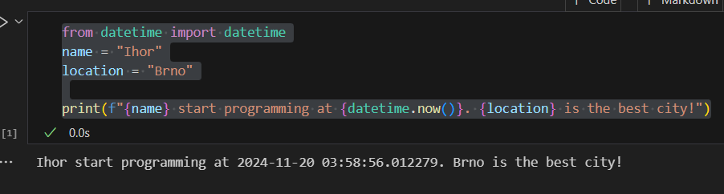

## Objective: Оформлення та здача робіт

1. **Installation**:
   - Installed the required Python plugins in Visual Studio Code (VS Code), including Python and Jupyter.
   
2. **First Python Script**:
I created a file `[my_first_app.py](my_first_app.py)` with the following code:

```python
from datetime import datetime
name = "Ihor"
location = "Brno"
print(f"{name} start programming at {datetime.now()}. {location} is the best city!")
```

5. **Jupyter Notebook**:

   - Created a new file `my_first_app.ipynb`.
   - Copied the code into the first cell and executed it. The output is displayed as shown below:

7. **Output**   ```python
   Ihor start programming at 2024-11-20 03:58:56.012279. Brno is the best city!
10. **Output**   ```python
   Ihor start programming at 2024-11-20 03:58:56.012279. Brno is the best city!
   